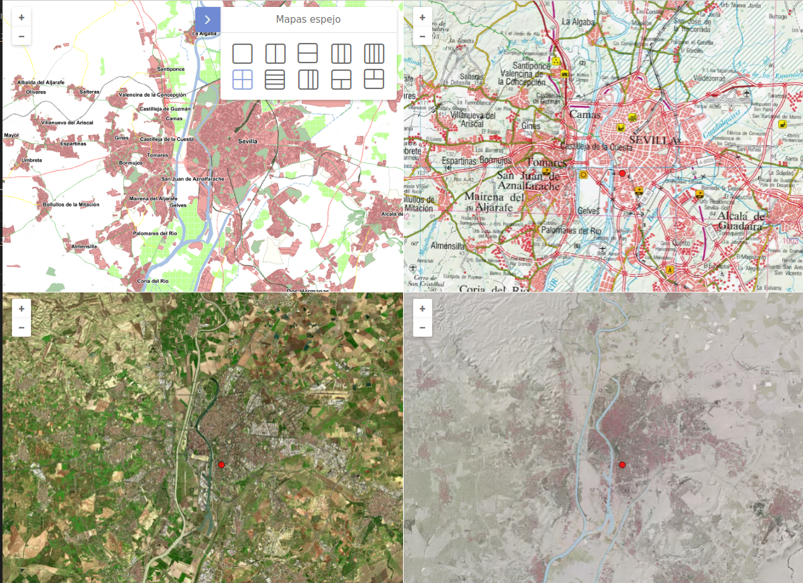

# M.plugin.Mirrorpanel

Plugin que permite comparar varias capas dividiendo la pantalla en varias partes. Los mapas tienen sus vistas sincronizadas, y podemos ver la representación de una misma zona por distintas capas.




# Dependencias

- mirrorpanel.ol.min.js
- mirrorpanel.ol.min.css


```html
 <link href="../../plugins/mirrorpanel/mirrorpanel.ol.min.css" rel="stylesheet" />
 <script type="text/javascript" src="../../plugins/mirrorpanel/mirrorpanel.ol.min.js"></script>
```

# Parámetros

- El constructor se inicializa con un JSON de options con los siguientes atributos:

- **position**. Indica la posición donde se mostrará el plugin.
  - 'TL':top left
  - 'TR':top right (default)
  - 'BL':bottom left
  - 'BR':bottom right

- **collapsible**. Si es *true*, el botón aparece, y puede desplegarse y contraerse. Si es *false*, el botón no aparece. Por defecto tiene el valor *true*.

- **collapsed**. Si es *true*, el panel aparece cerrado. Si es *false*, el panel aparece abierto. Por defecto tiene el valor *true*.

- **modeViz**. Define el tipo de comparación con la que arranca. Rango 0-9.
  - 0: mapa simple.
  - 1: dos mapas en vertical.
  - 2: dos mapas en horizontal.
  - 3: tres mapas en vertical.
  - 4: cuatro mapas en vertical.
  - 5: mosaico con cuatro mapas.
  - 6: cuatro mapas en horizontal.
  - 7: tres mapas en proporción 2-1-1.
  - 8: un mapa arriba y dos abajo.
  - 9: dos mapas arriba y uno abajo.

- **enabledKeyFunctions**. Si es *true*, se pueden usar las combinaciones de teclas Ctrl + Shift + [F1-F8] para cambiar entre los distintos modos de visualización. Con la tecla *Escape* se destruye el plugin. Por defecto tiene el valor *true*.

- **showCursors**. Si es *true*, muestra cursores sincronziados en cda unao de los mapas espejo. Por defecto tiene el valor *true*.

- **mirrorLayers**. Es un array de capas para mostrar en los mapas espejo y poder compararlas entre sí.

- **defaultBaseLyrs**. Es un array de capas para mostrar como mapa por defecto.

- **interface**. Define si mostrar o no la interfaz del plugin.

# Eventos

# Multi idioma

Actualmente viene preparado para español e inglés. Para definir con qué idioma arranca, hay que ir al fichero test.js y modificar

```javascript
M.language.setLang('es');//Idioma español
M.language.setLang('en');//Idioma inglés
```
Se pueden crear más ficheros de idioma. Basta con copiar la estructura de los ficheros **json** de la carpeta *\src\facade\js\i18n* , renombrar con la abreviatura del nuevo idioma (fr para el fránces), y cambiar los textos, manteniendo las *keywords*.

# Ejemplos de uso

## Ejemplo base

```javascript
const map = M.map({
   container: 'mapjs',
   center: {
      x: -667143.31,
      y: 4493011.77,
   },
   projection: "EPSG:3857*m",
   zoom: 8,
});

const mpMirrorPanel = new M.plugin.Mirrorpanel();
map.addPlugin(mpMirrorPanel);
```

## Ejemplo 1

```javascript
const map = M.map({
   container: 'mapjs',
   center: {
      x: -667143.31,
      y: 4493011.77,
   },
   projection: "EPSG:3857*m",
   zoom: 8,
});

const mpMirrorPanel = new M.plugin.Mirrorpanel({
  position: 'TR',
  collapsible: true,
  collapsed: false,
  modeViz: 0,
  enabledKeyFunctions: true, 
  showCursors: true,
  defaultBaseLyrs: [
    'WMTS*http://www.ign.es/wmts/mapa-raster?*MTN*GoogleMapsCompatible*MTN',
    'WMTS*http://www.ign.es/wmts/pnoa-ma?*OI.OrthoimageCoverage*GoogleMapsCompatible*PNOA',
    'WMTS*https://wmts-mapa-lidar.idee.es/lidar?*EL.GridCoverageDSM*GoogleMapsCompatible*LiDAR',
  ],
});

map.addPlugin(mpMirrorPanel);
```